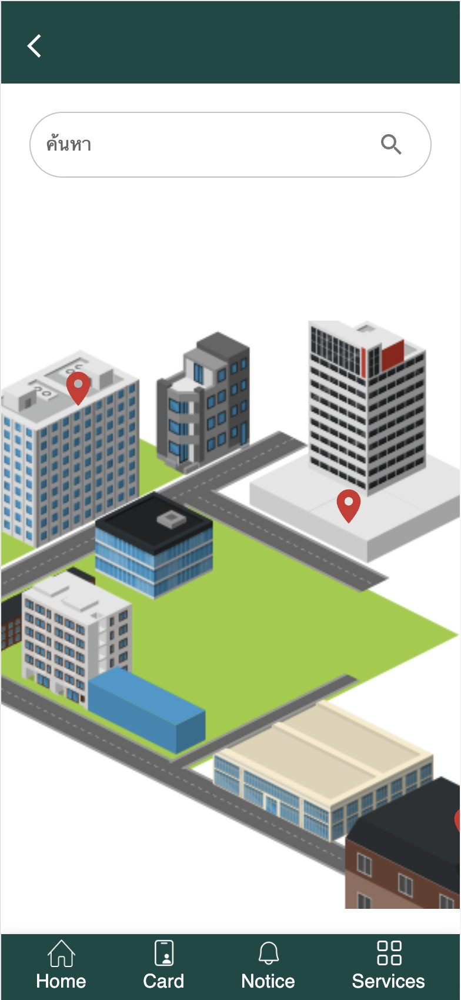
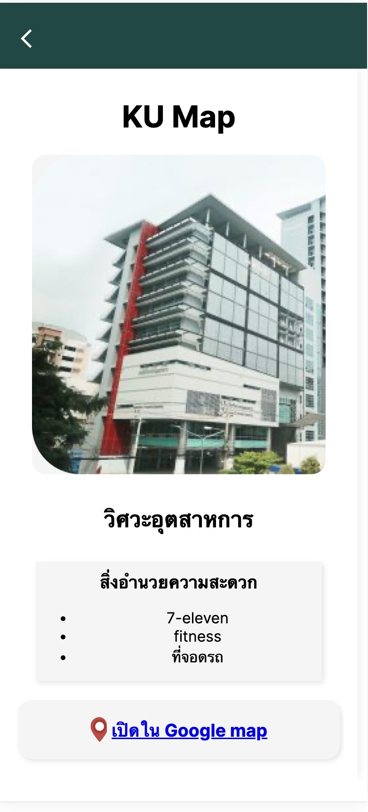
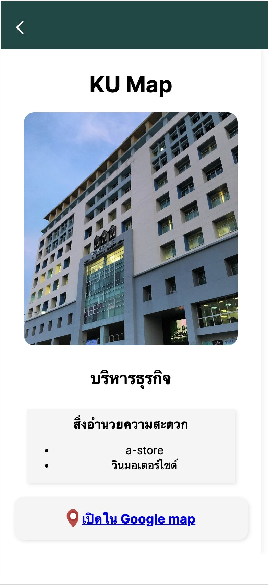
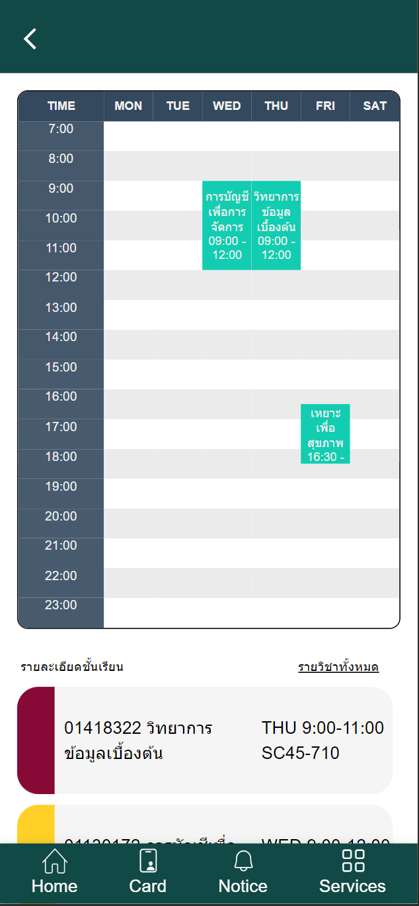
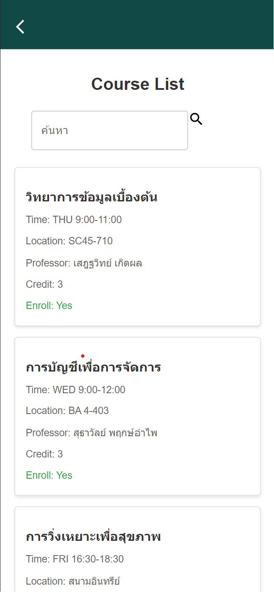
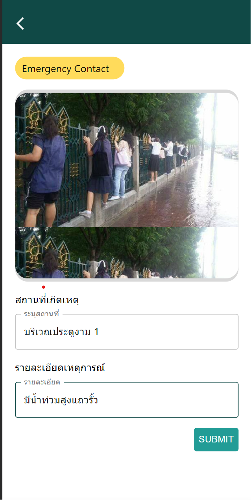
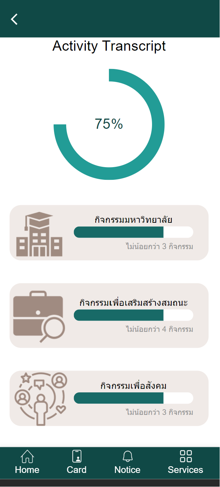

# KU Hackathon 2023 
## ชื่อกลุ่ม :  Prima
### วิธีติดตั้ง

clone git repositories นี้มา 
แล้วเปิด terminal เข้าถึง folder backend  จากนั้นให้พิมพ์คำสั่ง npm run dev  จากนั้นให้กลับมาแล้ว เข้าถึง folder frontend จากนั้นให้พิมพ์คำสั่ง npm run dev

---

username ตัวอย่าง : 6514051131  
password ตัวอย่าง :  1234

---
## ชื่อฟีเจอร์
* ### KU Map
* ### KU Planner
* ### KU Alert
* ### Activity Transcript
---
## ชื่อสมาชิกทีม
* ฑิตยา วีระชัย
* ปิ่นปวัฒน์ ลิ้มสุวัฒน์
* อิทธิกร อึงนิยม
---
### คำอธิบายฟีเจอร์
* KU Map เป็นแผนที่ของมหาวิทยาลัยเกษตรศาสตร์ มีหมุดปักไว้ในสถานที่ต่างๆ และสามารถกดเข้าไปดูข้อมูลเพิ่มเติมได้
* KU Planner เป็นฟีเจอร์ช่วยวางแผนการโดยผู้ใช้สามารถดูรายวิชาทั้งหมดและวางแผนตารางเรียนได้
* KU Alert เป็นฟีเจอร์แจ้งเหตุให้กับหน่วยงานต่างๆที่รับผิดชอบโดยถ่ายภาพและระบุที่อยู่พร้อมทั้งมีช่องทางการติดต่อหน่วยงานแนบมาให้ด้วย
* KU Activity Transcript
เป็นการปรับ UI เพื่อให้ Transcript นี้สามารถเข้าใจได้ง่าย และ สะดวกต่อการเช็ค

## ภาพหน้าจอตัวอย่างฟีเจอร์

---

---

---

### ลิงก์ Figma (ตามข้อ 2)

https://www.figma.com/file/h419J9oRQLKn31ebAx5WVi/Hackathon---Prima?type=design&node-id=0%3A1&mode=design&t=7bEdkVoeW3hGQztG-1
